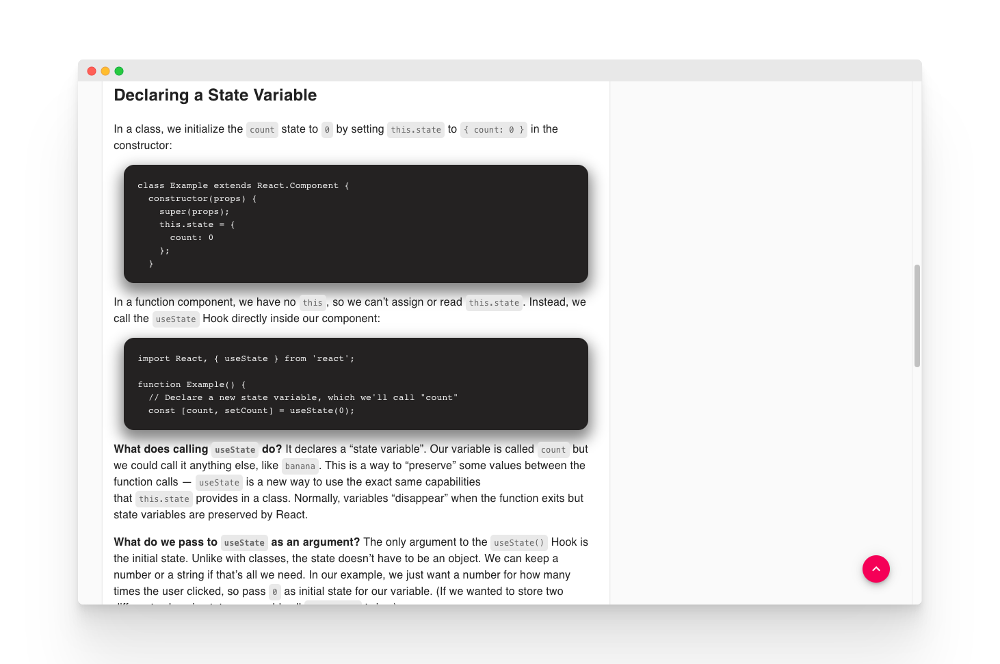
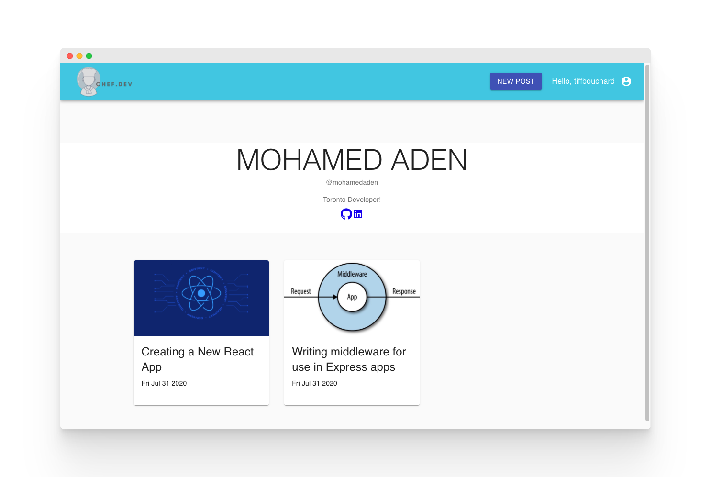
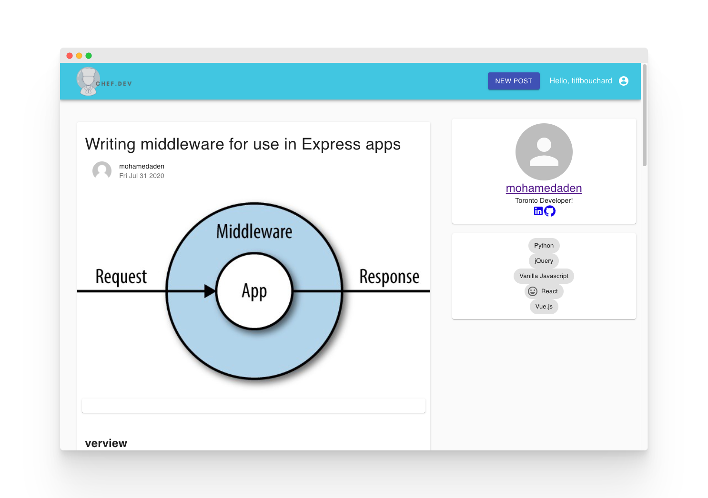
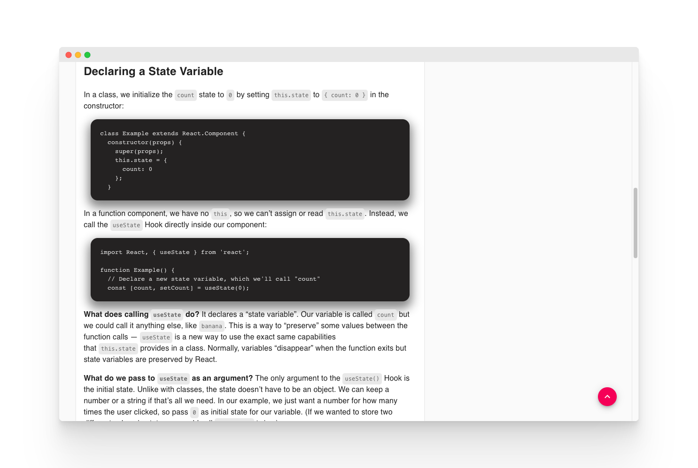
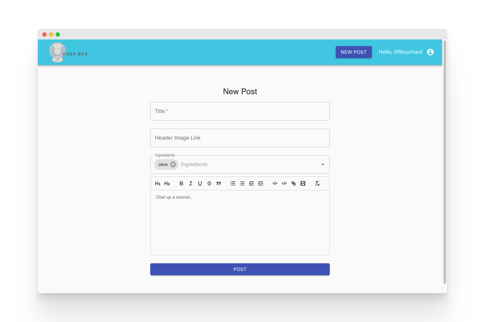
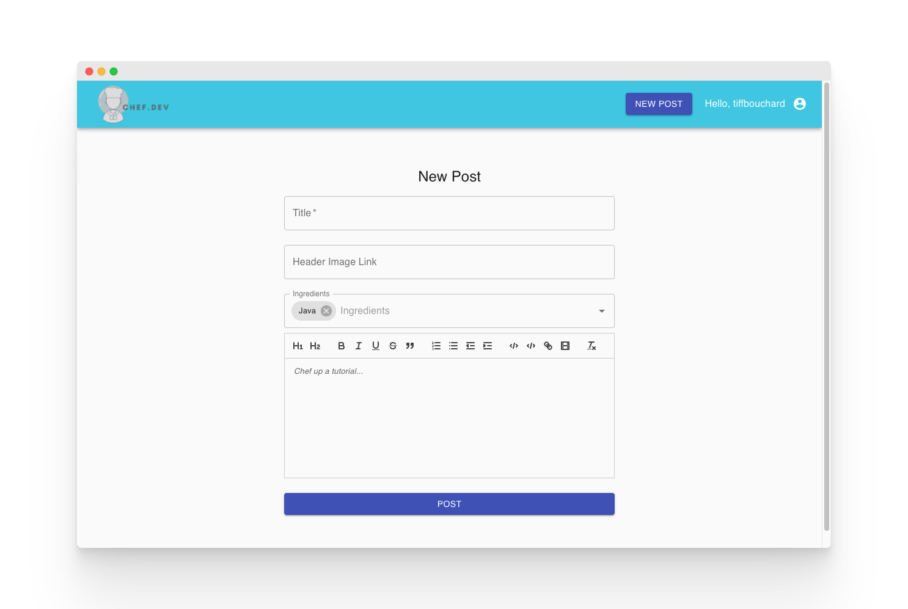

> An online library for programming tutorials. 

## Table of Contents
- [About](#about)
- [Features](#features)
- [Tech Stack](#tech-stack)
- [Planning](#planning)
- [Screenshots](#screenshots)
- [Getting Started](#getting-started)
- [Next Steps](#next-steps)
- [Contributors](#contributors)
- [Installations](#installation)

## About 
We found that often there are many great tutorials/resources all over the internet however, they often get lost in the many other resources or posts. Our app attempts to make tutorials a little more accessible whether they are your own original tutorials or ones you have found helpful. Share anything you like that may help others learn programming. You can also just use it to post tips and tricks you found helpful and want to save.

## Features
Posts:
1. Creating a post
2. Viewing all post on the homepage
3. Viewing your own post on your own profile page.
4. Deleting your own post

Tips:
1. Creating a tip under a specific post
2. Viewing tips under a specific post

User:
1. Creating a user
2. Updating user profile
3. Viewing the profile of other authors of posts.

## Tech Stack
- HTML + CSS
- Javascript
- React
- Material UI
- Node.js
- Express
- MongoDB/Mongoose

## Planning
- [User Stories](https://trello.com/b/QSFe0eSf/project-4)
- [Wireframes](https://app.diagrams.net/#Htiffbouchard%2FChef.dev%2Fmaster%2FWireframe%20-%20Chef.Dev.drawio)
- [ERD](https://app.diagrams.net/#Hdaronefrancis%2Fchef.dev%2Fmaster%2FERDs.drawio)

## Screenshots

## Getting Started 
Click [here](https://chefdev.herokuapp.com/) to view a demo 

## Next Steps
- Allow users to upload a profile picture / image for their post
- Allow users to submit an ingredient
- Complete validations on sign up form so no two users can have the same email or username
- Implement the ability to load more posts on click 
- When updating a profile, show their previous profile inputs in the form fields instead of empty fields
- If a page doesn't exist show a custom error page, right now it just takes you to a blank page of that specific template - public profiles and posts 
- Sort and categorize posts and have them display on the sidebar depending on these categories
- Make the ingredients list on the main sidebar dynamic and when clicked you can view recipes with those ingredients
- Fix search bar functionality
- Right now the adding an image to a post was taken away because we weren't able to control the size of the image so if it was too big we would get an error - fix this
- Add the ability to edit a post
- On the users detail page show the ingredients they use - they are just hard coded in right now

## Contributors

## Installation
1. Run ``npm install`` to install dependencies 
2. Build app for production ``npm run build``
3. Create an environment file (.env) with a `DATABASE_URL` & `SECRET_KEY`.
4. Have an instance of MongoDB running
5. Run `npm start` for client-side server
6. Run `nodemon server.js` for server-side server'
7. Go to localhost:3000 in the browser
